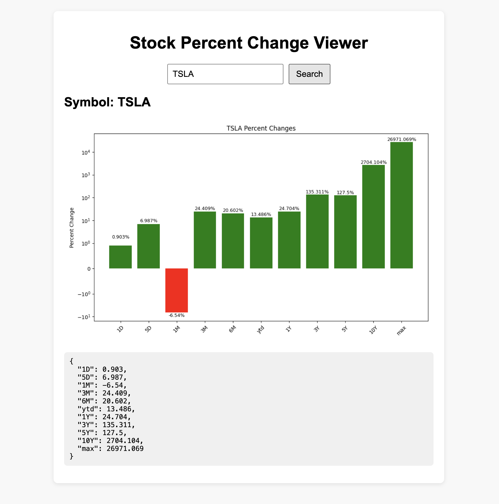

1) Executive Summary
Problem: My project is directed towards investors searching for stock, giving them a quick overview of changes in companies' stock prices of various increments of time.
Solution: I developed a containerized application that exposes a lightweight API powered by my Python application (main.py). The project uses environment variables for configuration, a clean Docker workflow for deployment, and includes seed data / example usage. The container can be run locally using a single command, and the entire project can be deployed to Azure or any cloud provider that supports Docker.

2) System Overview
Course Concepts Used: Docker containerization, FastAPI, External API usage.
Architecture Diagram: 
Data/Models/Services: fincancialmodelingprep API (requires API key), Enviromental variable (stored in .env), Python FastAPI.

3) How to Run (Local)
docker build -t final-project .
docker run --env-file .env -p 8000:8000 final-project
# (optional) health check
curl http://localhost:8000/health
OR
./run.sh

4) Design Decisions
Why this concept:Docker ensures reproducibility, easy grading, and cloud deployment without OS conflicts. Using environment variables keeps secrets out of the repo and allows different configurations. Alternatives Considered: Running locally without Docker — rejected due to dependency issues. Using Apptainer — possible but less aligned with cloud platform use cases.
Tradeoffs: Docker images increase storage footprint vs. pure Python scripts. Requires users to install Docker.
Security & Privacy: No secrets committed to GitHub. Uses .env loaded at runtime via --env-file. Validates inputs to prevent malformed requests.
Operations Considerations: Basic logging included (stdout). Can scale via multiple containers in Azure.
Limitations: local environment only tested; no autoscaling rules defined.

5) Result Evaluation

Validation/Tests: Tested with various valid and invalid inputs. Confirmed correct error messages and robust behavior when env variables missing.

6) What's Next
Deployment to public URL via Azure Web App for containers. Create another container on n8n to pull other relevant information on stock search such as the most recent news. Further polish front end for better readability.

7) Links
GitHub Repo: https://github.com/AverageUserID/final-project
